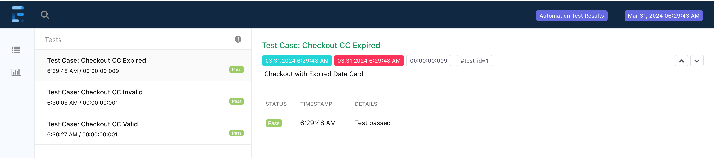
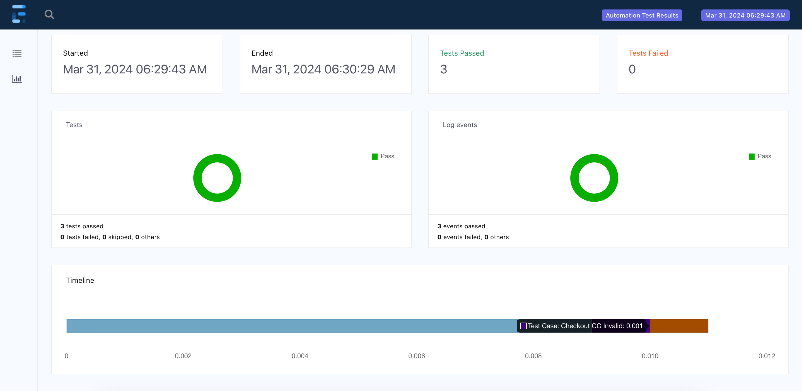

# Simple Automation Test with Java
This project demonstrates how to use Selenium with TestNG for automated web testing, along with ExtentReports for generating detailed test reports.

## Project Structure
- src/test/java/com/midtrans/demo - Contains the test classes and supporting code.
- ReportManager.java - Utility class for managing ExtentReports instance.
- InitBase.java - Base class for tests that sets up, inits and tears down WebDriver and ExtentReports.
- CheckoutTest.java - Example test class with test cases.
- pom.xml - Maven project file with dependencies and build configuration.

## Installation

- Install Java: Ensure you have Java JDK installed on your system.
- Install Maven: Ensure you have Maven installed for managing dependencies and running tests.
- Clone the Repository: Clone this repository to your local machine.
- Install Dependencies: Navigate to the project root directory and run mvn install to install the required dependencies.

## Usage

- Run All Tests: Execute mvn test in the project root directory to run all tests.
- Run Specific Test: Execute mvn test "-Dtest=CheckoutTest#testSuccessfulCheckout" to run a specific test method.

## Test Reporting
After running the tests, ExtentReports generates an HTML report in the test-output directory. You can open the testReport.html file in a web browser to view the test results, including logs.

## Architecture/Flow
                  +-------------------------+
                  |   InitTest              |
                  | - Setup WebDriver       |
                  | - Setup ExtentReports   |
                  +-----------+-------------+
                              |
                              v
                  +-----------+---------------+
                  | ReportManager             |
                  | - Manages ExtentReports   |
                  +-----------+---------------+
                              |
                              v
            +-----------------+-------------------+
            |                 |                   |
            v                 v                   v
    +-------+-------+   +-----+---------+   +-----+---------+
    | CheckoutTest  |   | OtherTest     |   | AnotherTest   |
    | - Test methods|   | - Test methods|   | - Test methods|
    +-------+-------+   +---------------+   +---------------+
            |
            v
    +-------+------------+
    | ExtentReports      |
    | - Generates report |
    +--------------------+

- InitTest: All test classes extend InitTest, which handles the setup and teardown of WebDriver and ExtentReports. It ensures that each test has a fresh browser instance and that test results are logged appropriately.
- ReportManager: Manages the singleton instance of ExtentReports, ensuring that only one instance is created and used throughout the test execution.
- CheckoutTest: Contains test methods. Each test method logs its steps and results to ExtentReports. The InitTest class ensures that the WebDriver is quit and the ExtentReports instance is flushed after each test method.
- ExtentReports: At the end of the test execution, ExtentReports generates a detailed HTML report with the results of all executed tests.

## Contributing

You can customize the tests, test data, and reporting as needed for your specific testing requirements. Add more test classes and methods as needed, and modify the ReportManager and TestBase classes to adjust the reporting and WebDriver setup.
Make a Pull Request and mention the Author/Code Owner if you want to contribute. Thanks!

## License

This project is licensed under the MIT License. See the [LICENSE](LICENSE) file for details.
